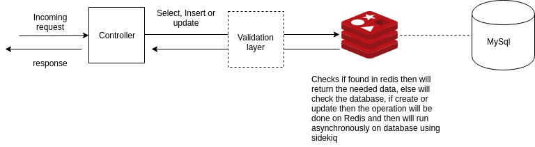
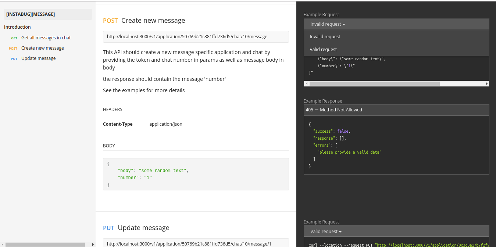

# Chat System

The purpose of this project is to create a chat system that has: <br>

1- Applications <br>
2- Chats <br>
3- Messages <br>

Each *application* have many *chats* as well as many *messages*, *applications* have a unique `id` and `token`, *chats* have also a unique `id` and `number` as well as *messages*.

User should deal with *applications* through providing `token`, *chats* through `number` and same for *messages* knowing nothing about the `ids` of any table.

## System dependencies

* Used `Docker` for containerizing the project, `Ruby On Rails` for back-end development, `Redis` for shared memory and `MySql` for presestent data.

## Installation Steps

* Clone this repo to your local machine.
* install `docker` and `docker-compose`
* run the project with `docker-compose up` and you should be good to go, no need to bundle install or migrate.

## How to run the test suite

Tests was done using rspec. Just run `docker-compose run web rspec` and you should see the test cases passing.

## Folder Structure

### Base folder structure

```
./
├── app
├── bin
├── db
├── spec

```
*The project structure has more folders/files than this, however these ones are the most important ones that holds the application logic*.


* `app` holds the application `contollers`, `helpers`, `jobs` , `models` and `serializers` as well as other folders. will discuess each one in a later part. 

*  `bin` contains the `entry` file that is responsible for *bundle install* as well as *migrate* scripts.

* ` db` contains the application `schema` as well as `migrations` 

* ``` spec ``` holds the test cases *just unit tests for model validations*.

## Database Schema

As shown in ``` db/schema.rb ```, the Database Schema is as follows: 

```
  create_table "applications", options: "ENGINE=InnoDB DEFAULT CHARSET=latin1", force: :cascade do |t|
    t.string "application_token"
    t.string "name"
    t.integer "chats_count"
    t.datetime "created_at", null: false
    t.datetime "updated_at", null: false
    t.index ["application_token"], name: "index_applications_on_application_token"
  end

  create_table "chats", options: "ENGINE=InnoDB DEFAULT CHARSET=latin1", force: :cascade do |t|
    t.bigint "application_id"
    t.integer "messages_count"
    t.integer "number"
    t.datetime "created_at", null: false
    t.datetime "updated_at", null: false
    t.index ["application_id"], name: "index_chats_on_application_id"
    t.index ["number"], name: "index_chats_on_number"
  end

  create_table "messages", options: "ENGINE=InnoDB DEFAULT CHARSET=latin1", force: :cascade do |t|
    t.bigint "chat_id"
    t.string "body"
    t.integer "number"
    t.datetime "created_at", null: false
    t.datetime "updated_at", null: false
    t.index ["chat_id"], name: "index_messages_on_chat_id"
    t.index ["number"], name: "index_messages_on_number"
  end
```
We have 3 tables: <br>

### Applications
Application contains id, token, chats_count and name that was provided by the user.<br>

### Chats
Chats contains id, number, messages_count and application_id as a foriegn key.

### Messages
Message contains id, number, body that was provided by user and chat_id as a foriegn key.

*All of the tables has created_at and updated_at*

## Flow and Logic

This application tends to achieve the needed requirements with high time effency, so instead  of relying in the database as a data source it relies on `Redis` instead, check the following diagram.



As you can see the request coming from the router to the controller passes on a validation layer before dealing with redis or database, only the insert and update passes on those validations, you can find redis validations on `helpers/redis_operations/[any-of-the-models]/validations.rb`, Application don't have validations as it is the only API that deals directly with the database for being the main dependency for any of the chat and/or messages requests.

After passing the validation it goes to the insert/update redis operation and you can find them in the same folder as well.

Then the controller runs a background job for inserting/updating the field asyncronsly and you can find the jobs in `jobs/` folder.

*As mentioned before `application` don't have jobs and also `chat` don't have an update API, I couldn't decide what could be updated in `chat` as it contains an application_id, number and those can't be changed, messages count are increasing based on messages creation so no field is eligable for updating hence I've commented the update operation* 

As a model layer for validation you'll find a validations on the `models/[any-model]`.

You'll also find a commented docker image for `elasticsearch` and a commented router for the search but sadly I ran out of time and couldn't finish it.

## APIs Documentation

For APIs documentation I've used `Postman` You'll find a description in each one for a valid and invalid requests *except for the GET requests only have a valid requests examples*


### Response body

Response body consists of: <br>
* success -> indicates that the request was successfull or not <br>
* response -> the required return, will be empty if the success is false <br>
* errors -> array of the errors if the success is false, will be empty if sucess is true <br>
  
  ```
    "success": true,
    "response": {
        "application_token": "0c3c3a17b7f2f96641bd",
        "name": "true"
    },
    "errors": []
  ```

I've separated the documentation into 3 folders :
- Applications : <a>https://documenter.getpostman.com/view/4628217/SVYrsyjE?version=latest</a>
- Chats : <a>https://documenter.getpostman.com/view/4628217/SVYrsyjG?version=latest</a>
- Messages:  <a>https://documenter.getpostman.com/view/4628217/SVYrsyjJ?version=latest</a>

As you can see in the screenshot below you can find the end-points on the left, description in the middle and examples in the right.


